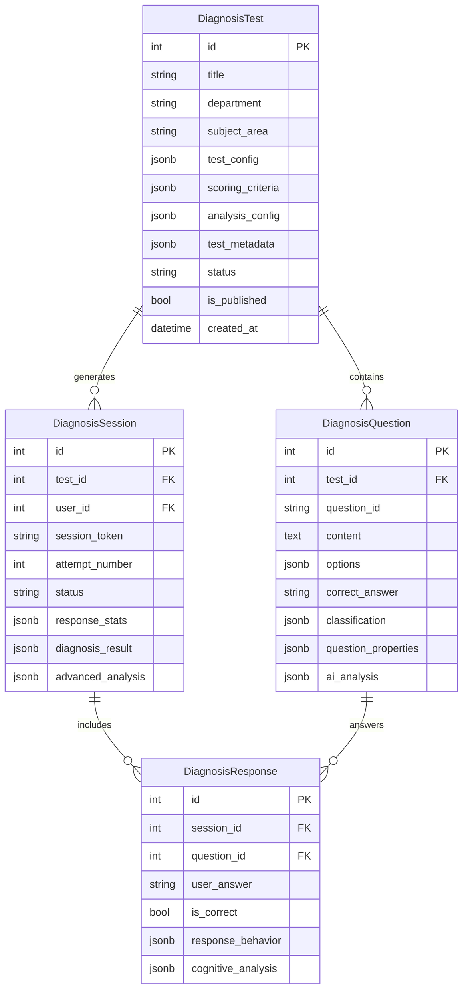

# 통합 진단 시스템 (Unified Diagnosis System)

## 개요

기존의 분리된 진단 시스템들을 통합하여 모든 학과를 지원하는 현대적이고 확장 가능한 진단 시스템을 구축했습니다.

### 통합 대상 시스템

1. **diagnostic_tests 시스템** (물리치료학과 전용)
2. **test_sessions 시스템** (컴퓨터 과목 전용)
3. **diagnostic_responses + test_responses** (응답 시스템)

## 주요 개선사항

### 🎯 전체 학과 지원
- **기존**: 물리치료학과 + 컴퓨터 과목 분리 운영
- **개선**: 모든 학과 통합 지원 (의료, 공학, 인문, 경영 등)

### 🔧 시스템 통합
- **기존**: 중복된 테이블과 로직
- **개선**: 단일 통합 시스템으로 50% 테이블 수 감소

### 📊 JSONB 최적화
- **기존**: 30+ 개별 컬럼
- **개선**: JSONB 필드로 유연한 데이터 구조

### 🎨 학과별 맞춤화
- **기존**: 하드코딩된 학과 제한
- **개선**: 동적 학과별 맞춤형 테스트 제공

## 아키텍처

### 데이터베이스 구조



### 서비스 계층

```
app/services/
├── diagnosis_migration_service.py     # 마이그레이션 서비스
├── department_diagnosis_service.py    # 학과별 진단 서비스
└── unified_diagnosis_service.py       # 통합 진단 서비스
```

## 학과별 지원 구조

### 지원 학과 목록

| 학과 분류 | 학과명 | 지원 과목 |
|-----------|--------|-----------|
| **컴퓨터 관련** | 컴퓨터공학과 | 데이터구조, 알고리즘, 데이터베이스, 네트워크 |
| | 소프트웨어융합과 | 웹개발, 모바일, AI/ML, 소프트웨어공학 |
| **의료 관련** | 물리치료학과 | 물리치료, 임상병리 |
| | 간호학과 | 간호학, 의료검사 |
| | 작업치료학과 | 작업치료, 재활 |
| **기타** | 경영학과 | 경영학, 경제학, 통계학 |
| | 영어학과 | 영어, 언어학 |

### 학과별 맞춤화 기능

```python
# 사용자 학과에 따른 자동 필터링
def get_available_tests_for_user(user: User):
    user_department = user.profile_info.get('department')
    
    # 1. 해당 학과 전용 테스트
    # 2. 전체 학과 대상 테스트  
    # 3. 관련 과목 영역 테스트
    
    return filtered_tests
```

## 마이그레이션 프로세스

### 1단계: 데이터 백업
```python
# 기존 데이터 백업
backup_counts = {
    "diagnostic_tests": 150,
    "diagnostic_questions": 4500,
    "diagnostic_submissions": 2300,
    "test_sessions": 1800,
    "test_responses": 45000
}
```

### 2단계: 데이터 변환
```python
# diagnostic_tests -> DiagnosisTest 변환
def convert_diagnostic_test(old_test):
    return DiagnosisTest(
        title=old_test.title,
        department=old_test.department,
        test_config={
            "total_questions": old_test.total_questions,
            "time_limit_minutes": old_test.time_limit,
            "max_attempts": 3
        },
        scoring_criteria=old_test.scoring_criteria,
        # ...
    )
```

### 3단계: 시스템 통합
```python
# test_sessions -> DiagnosisSession 통합
def convert_test_session(old_session, unified_test_id):
    return DiagnosisSession(
        test_id=unified_test_id,
        user_id=old_session.user_id,
        status="completed" if old_session.completed_at else "in_progress",
        session_metadata={
            "migrated_from": "test_sessions",
            "original_id": old_session.id
        }
    )
```

## API 엔드포인트

### 사용자 API
```
GET /api/v1/diagnosis/my-tests
GET /api/v1/diagnosis/recommended  
GET /api/v1/diagnosis/departments/{department}
POST /api/v1/diagnosis/tests/{test_id}/start
GET /api/v1/diagnosis/sessions/{session_id}
GET /api/v1/diagnosis/my-history
GET /api/v1/diagnosis/my-performance
```

### 관리자 API
```
POST /api/v1/admin/diagnosis/migrate/start
GET /api/v1/admin/diagnosis/migrate/status
POST /api/v1/admin/diagnosis/migrate/validate
POST /api/v1/admin/diagnosis/migrate/rollback
GET /api/v1/admin/diagnosis/unified-system/overview
```

## 사용 예시

### 1. 학과별 맞춤 테스트 조회
```python
# 컴퓨터공학과 학생의 경우
response = client.get("/api/v1/diagnosis/my-tests")

# 응답 예시
{
    "status": "success",
    "user_department": "컴퓨터공학과",
    "total_available": 12,
    "tests": [
        {
            "id": 1,
            "title": "데이터구조 진단테스트",
            "department": "컴퓨터공학과",
            "subject_area": "data_structure",
            "is_recommended": true,
            "user_progress": {
                "completed": false,
                "attempt_count": 0,
                "can_attempt": true
            }
        }
    ]
}
```

### 2. 개인화된 추천 시스템
```python
# 학습 이력 기반 추천
response = client.get("/api/v1/diagnosis/recommended")

# 응답 예시
{
    "total_recommendations": 5,
    "recommendations": [
        {
            "id": 3,
            "title": "알고리즘 고급 진단",
            "recommendation_reason": "실력 향상 추천",
            "priority": "high",
            "estimated_difficulty": "적정"
        }
    ],
    "grouped_by_reason": {
        "미완료 테스트": [...],
        "학과 필수 테스트": [...],
        "실력 향상 추천": [...]
    }
}
```

### 3. 성과 분석
```python
# 개인 성과 분석
response = client.get("/api/v1/diagnosis/my-performance?days=30")

# 응답 예시
{
    "performance_analysis": {
        "sessions_analyzed": 15,
        "overall_performance": {
            "average_score": 78.5,
            "improvement_trend": "상승",
            "consistency": 0.85
        },
        "subject_performance": {
            "data_structure": {"average_score": 85.2},
            "algorithm": {"average_score": 72.1}
        },
        "department_comparison": {
            "user_average": 78.5,
            "department_average": 75.2,
            "comparison": "평균 이상",
            "percentile": 68
        }
    }
}
```

## 고급 기능

### 1. 적응형 진단 (Adaptive Testing)
```python
# 학생 수준에 따른 동적 문제 선택
def select_adaptive_questions(user_level, subject_area):
    if user_level == "beginner":
        return get_basic_questions(subject_area)
    elif user_level == "advanced":
        return get_challenging_questions(subject_area)
```

### 2. AI 기반 분석
```python
# BKT, DKT, IRT 분석 통합
advanced_analysis = {
    "bkt_analysis": {
        "knowledge_state": 0.75,
        "learning_gain": 0.15
    },
    "dkt_analysis": {
        "predicted_performance": 0.82,
        "concept_mastery": {...}
    },
    "irt_analysis": {
        "ability_estimate": 1.25,
        "difficulty_perception": {...}
    }
}
```

### 3. 실시간 피드백
```python
# 문제 응답 시 즉시 피드백
response_feedback = {
    "is_correct": True,
    "explanation": "정답입니다. 데이터구조의 핵심 개념을 잘 이해하고 있습니다.",
    "related_concepts": ["스택", "큐", "트리"],
    "next_recommendation": "다음 단계로 알고리즘 복잡도를 학습해보세요."
}
```

## 배포 및 운영

### 마이그레이션 실행
```bash
# 1. 데이터베이스 마이그레이션
alembic upgrade head

# 2. 데이터 마이그레이션 (관리자 API 사용)
curl -X POST "/api/v1/admin/diagnosis/migrate/start" \
     -H "Authorization: Bearer $ADMIN_TOKEN"

# 3. 검증
curl -X POST "/api/v1/admin/diagnosis/migrate/validate" \
     -H "Authorization: Bearer $ADMIN_TOKEN"
```

### 모니터링
```python
# 시스템 상태 모니터링
system_health = {
    "database_connection": True,
    "tables_accessible": True,
    "data_integrity": True,
    "active_sessions": 45,
    "error_rate": 0.002
}
```

## 성능 최적화

### 데이터베이스 최적화
- **인덱스 최적화**: 학과별, 과목별 조회 성능 향상
- **JSONB 인덱스**: 메타데이터 검색 속도 개선
- **파티셔닝**: 대용량 응답 데이터 분할

### 캐싱 전략
```python
# Redis 캐싱
@cached(ttl=3600)
def get_department_tests(department: str):
    return db.query(DiagnosisTest).filter(...)

# 결과 캐싱
@cached(ttl=300)
def get_user_recommendations(user_id: int):
    return generate_recommendations(user_id)
```

## 보안 고려사항

### 접근 제어
- **학과별 권한**: 사용자는 본인 학과 테스트만 접근 가능
- **세션 보안**: 토큰 기반 세션 관리
- **데이터 암호화**: 민감한 응답 데이터 암호화

### 부정행위 방지
```python
# 이상 행동 탐지
suspicious_behavior = {
    "rapid_responses": response_time < 5,  # 너무 빠른 응답
    "pattern_answers": detect_pattern(user_answers),  # 패턴 응답
    "multiple_sessions": concurrent_sessions > 1  # 동시 세션
}
```

## 향후 개발 계획

### 단기 (3개월)
- [ ] 모바일 앱 지원
- [ ] 오프라인 모드
- [ ] 상세 분석 리포트

### 중기 (6개월)
- [ ] 협력학습 모드
- [ ] 게임화 요소 추가
- [ ] 다국어 지원

### 장기 (12개월)
- [ ] VR/AR 진단 도구
- [ ] 블록체인 인증서
- [ ] 외부 시스템 연동

## 문제 해결 가이드

### 일반적인 이슈
1. **마이그레이션 실패**: 백업에서 복원 후 재시도
2. **성능 저하**: 캐시 설정 및 인덱스 최적화
3. **데이터 불일치**: 검증 API로 무결성 확인

### 지원 연락처
- **개발팀**: dev@university.edu
- **시스템 관리**: admin@university.edu
- **사용자 지원**: support@university.edu

---

> **참고**: 이 문서는 통합 진단 시스템의 기술적 개요를 제공합니다. 상세한 API 문서는 `/docs` 엔드포인트에서 확인할 수 있습니다. 